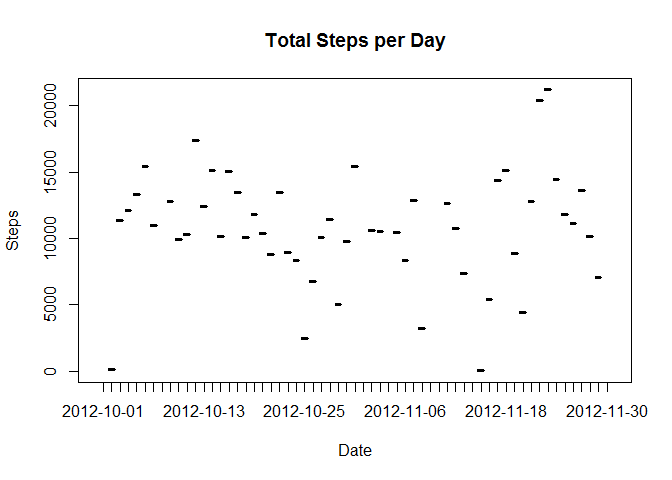
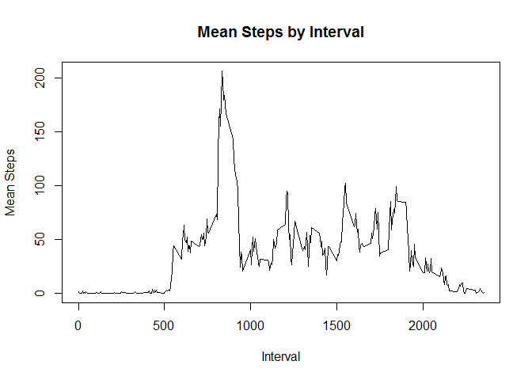
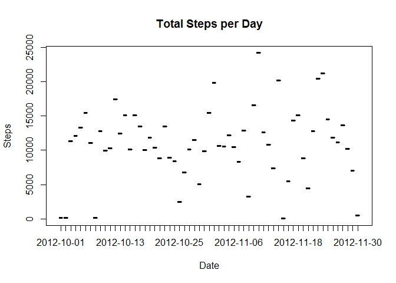
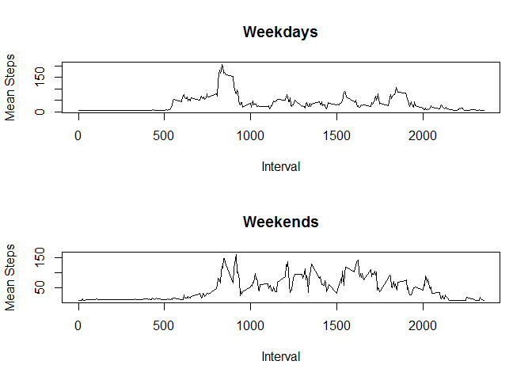

# Reproducible Research: Peer Assessment 1


## Loading and preprocessing the data

```r
library(reshape2)
act <- read.csv("activity.csv")
```

## What is mean total number of steps taken per day?

```r
meltSteps <- melt(act, id.vars = "date", measure.vars = "steps", na.rm = F)
stepsByDate <- dcast(meltSteps, date ~ variable, sum)
plot(stepsByDate$steps ~ stepsByDate$date, type = "h", main = "Total Steps per Day", xlab = "Date", ylab = "Steps")
```

<!-- -->

```r
paste("Mean steps per day:", mean(stepsByDate$steps, na.rm = T))
```

```
## [1] "Mean steps per day: 10766.1886792453"
```

```r
paste("Median steps per day:", median(stepsByDate$steps, na.rm = T))
```

```
## [1] "Median steps per day: 10765"
```

## What is the average daily activity pattern?

```r
meltStepsByInt <- melt(act, id.vars = "interval", measure.vars = "steps", na.rm = T) 
stepsByInt <- dcast(meltStepsByInt, interval ~ variable, mean)
plot(stepsByInt$steps ~ stepsByInt$interval, type = "l", main = "Mean Steps by Interval", xlab = "Interval", ylab = "Mean Steps")
```

<!-- -->

```r
paste("Interval with max steps:", stepsByInt$interval[which(stepsByInt$steps == max(stepsByInt$steps))])
```

```
## [1] "Interval with max steps: 835"
```

## Imputing missing values

```r
paste("Rows with NA data:",sum(is.na(act$steps)))
```

```
## [1] "Rows with NA data: 2304"
```

```r
actFix <- act
actMerg = merge(actFix, stepsByInt, by = "interval", suffixes = c(".act", ".spi"))
actFix[which(is.na(actFix$steps)), "steps"] = actMerg[which(is.na(actFix$steps)), "steps.spi"]

meltStepsFix <- melt(actFix, id.vars = "date", measure.vars = "steps", na.rm = F)
stepsByDateFix <- dcast(meltStepsFix, date ~ variable, sum)
plot(stepsByDateFix$steps ~ stepsByDateFix$date, type = "h", main = "Total Steps per Day", xlab = "Date", ylab = "Steps")
```

<!-- -->

```r
paste("Mean steps per day:", mean(stepsByDateFix$steps, na.rm = T))
```

```
## [1] "Mean steps per day: 10889.7992576554"
```

```r
paste("Median steps per day:", median(stepsByDateFix$steps, na.rm = T))
```

```
## [1] "Median steps per day: 11015"
```

## Are there differences in activity patterns between weekdays and weekends?

```r
actFix$date <- as.Date(actFix$date)
actFix$dayType <- ifelse(weekdays(actFix$date) == "Saturday" | weekdays(actFix$date) == "Sunday", "Weekend", "Weekday")

meltDay <- melt(actFix[actFix$dayType == "Weekday", ], id.vars="interval", measure.vars="steps")
meltEnd <- melt(actFix[actFix$dayType == "Weekend", ], id.vars="interval", measure.vars="steps")
castDay <- dcast(meltDay, interval ~ variable, mean)
castEnd <- dcast(meltEnd, interval ~ variable, mean)

par(mfrow = c(2, 1))

plot(castDay$steps ~ castDay$interval, type = "l", main = "Weekdays", xlab = "Interval", ylab = "Mean Steps")
plot(castEnd$steps ~ castEnd$interval, type = "l", main = "Weekends", xlab = "Interval", ylab = "Mean Steps")
```

<!-- -->
